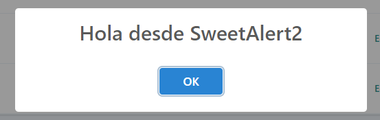

## Integrar [SweetAlert2](https://sweetalert2.github.io/)
SweetAlert2 es un sistema de popup's responsive y customizables
### Requisitos
El procedimiento explicado en este documento se realiza con [Vue.js](https://laravel.com/docs/7.x/frontend#writing-vue-components)
### Instalación
Ejecutar el comando:
```bash
npm i vue-sweetalert2
```
### Activación
Editar el fichero resources\js\app.js y añadir las siguientes líneas:
```javascript
import VueSweetalert2 from 'vue-sweetalert2';
import 'sweetalert2/dist/sweetalert2.min.css';
// después de la línea window.Vue = require('vue');
Vue.use(VueSweetalert2);
```
### Prueba
En un fichero Javascript (o Vue), ejecutar este código a través de un evento:
```javascript
this.$swal('Hola desde SweetAlert2');
```
Se tendría que ver algo como esto:


